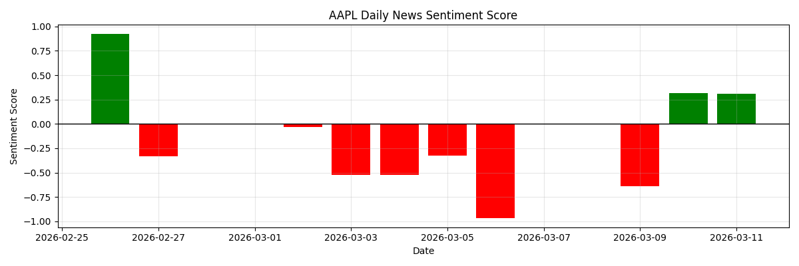
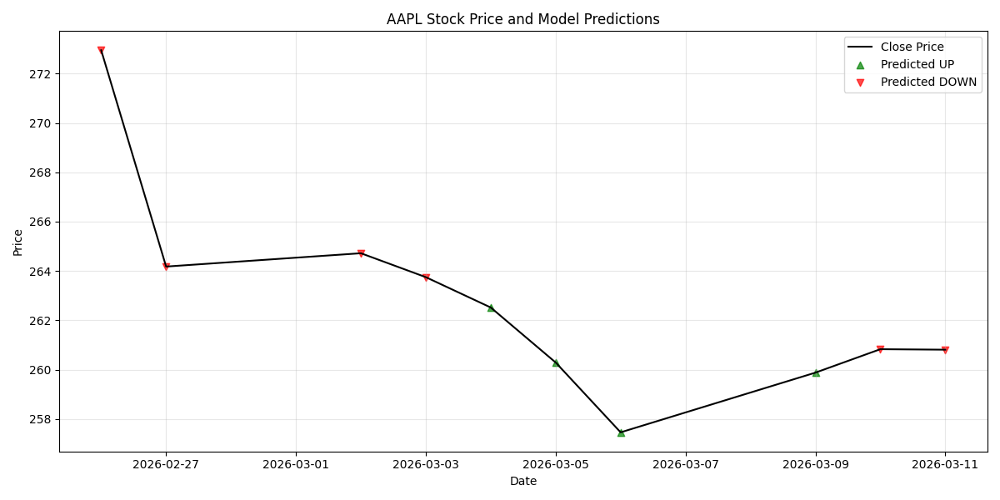
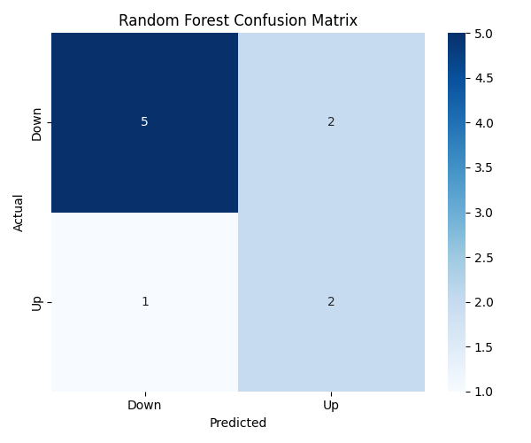

# AI Stock Price Predictor

The Stock Price Predictor is an end-to-end machine learning pipeline that collects historical market data, extracts financial news, analyzes sentiment using Natural Language Processing (NLP), and predicts whether a specific stock will go "Up" or "Down" in the next trading day.

## Business Problem

Financial markets are highly influenced by public perception and breaking news. A positive earnings report or an unexpected executive departure can cause immediate stock price volatility. By quantifying the tone of daily financial news headlines and incorporating them alongside historical price momentum, we can identify short-term alpha signals. This project serves to demonstrate how combining unstructured text data (news) with structured time-series data (prices) can improve predictive classification models.

## Dataset Sources

1. **Market Data**: Daily stock OHLCV (Open, High, Low, Close, Volume) data is fetched via the widely used `yfinance` API.
2. **News Data**: Recent news headlines are scraped using the `yfinance` Ticker news property. Because most financial APIs charge premium rates for deep historical news, our pipeline includes a reliable `simulate_historical_news` module to populate a backtesting dataset with realistic sentiments ("Positive", "Negative", "Neutral") to test the model's learning capabilities effectively without paid API keys.

## Model Approach

The pipeline performs the follow steps sequentially:
1. **Data Pipeline (`src/data_pipeline.py`)**: Fetches price and text data.
2. **Sentiment Analysis (`src/sentiment_analysis.py`)**: Utilizes HuggingFace Transformers and the `ProsusAI/finbert` model (a BERT model fine-tuned on financial text) to classify news into sentiment categories and aggregate them into a daily Sentiment Score.
3. **Model Training (`src/model_training.py`)**:
    - **Feature Engineering**: Calculates daily returns, 5-day Simple Moving Average (SMA), 10-day SMA, and joins the day's Sentiment Score.
    - **Target Variable**: Predicts whether `Close` price of $Day_{T+1} > Close$ price of $Day_{T}$ (Binary Class: 1 -> Up, 0 -> Down).
    - **Classifiers**: Trains a `RandomForestClassifier` and `LogisticRegression` to find non-linear and linear relationships respectively between sentiment, technical indicators, and future price movements.

## Evaluation Results

The models are evaluated using a time-series aware train/test split (80/20) to prevent data leakage.
Key metrics generated:
- **Accuracy**: Overall correct direction predictions.
- **Precision/Recall**: To measure the model's reliability when predicting positive stock movements.
- **F1 Score**: The harmonic mean of precision and recall.

Our evaluation scripts produce multiple visualizations to deeply understand the model behavior.

### Example Charts

*(Note: These charts are generated locally in the `plots/` directory when you run `src/evaluation.py`.)*

#### 1. Sentiment Scores Over Time
Visualizes the aggregated positive or negative tilt of the news for a specific ticker on a daily basis. High positive spikes usually precede strong price momentum.


#### 2. Stock Price Movement & Predictions
Depicts the historical closing price plotted over time. The overlay features discrete markers pointing Up (Green) or Down (Red) on days where the model executes a directional prediction based on the previous day's variables.


#### 3. Prediction Accuracy (Confusion Matrix)
A heatmap depicting True Positives, True Negatives, False Positives, and False Negatives, establishing where the model is confident vs where it is confused.


## Future Improvements

- **Larger Scale News Integrations**: Integrate with the Alpaca API or the NewsAPI to ingest larger loads of real-time multi-source data.
- **Intraday Trading**: Move from daily predictive horizons to hourly or minute-by-minute forecasting.
- **Feature Importance**: Injecting macro-economic indicators (e.g., bond yields, interest rates, VIX) to contextualize independent company shifts.
- **Advanced Deep Learning**: Switch standard scikit-learn models out for LSTMs or Temporal Convolutional Networks (TCNs) specifically designed to carry state over long time-series sequences.

---

## How to Run Locally

**1. Create virtual environment and install dependencies**
```bash
python -m venv venv
source venv/bin/activate  # On Windows: venv\Scripts\activate
pip install -r requirements.txt
```

**2. Run the pipeline sequentially**
```bash
python src/data_pipeline.py
python src/sentiment_analysis.py
python src/model_training.py
python src/evaluation.py
```

**3. Explore via Notebooks**
Open Jupyter Notebook to explore data and interact with the modules step by step.
```bash
jupyter notebook
```
Navigate to `notebooks/exploration.ipynb` or `notebooks/model_demo.ipynb`.
